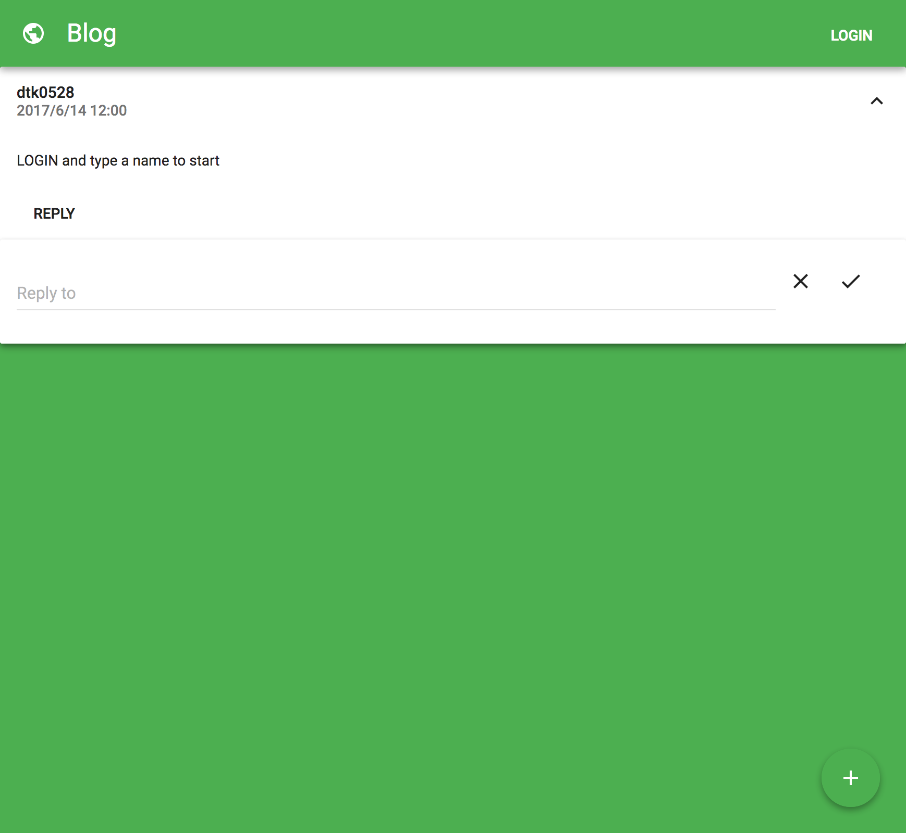

Blog
=========
  
  

## Demo

A working live demo [https://blog-dtk0528.now.sh](https://blog-dtk0528.now.sh)

## Features

* Post
* Reply to posts
* Show posts and replys timestamp
* Use database to store posts and replys

---

## Setup

#### Get the source code  

	git clone https://github.com/dtk0528/blog.git
	cd blog
	
#### Download and install all the dependencies (in server/ and client/)

	yarn install
  
---
	
## Usage

#### Build the app for production (in client/)

	yarn run build

#### Start the server (in server/)

	yarn start

#### Open a browser and go to

	localhost:3001

---

## Built With

* [Express](http://expressjs.com/) - Web framwork for Node.js
* [Knex.js](http://knexjs.org/) - A SQL Query Builder for Javascript
* [React](https://facebook.github.io/react/) - A JavaScript library for building user interfaces
* [Redux](http://redux.js.org/) - Predictable state container for JavaScript apps
* [Webpack](https://webpack.github.io/) - A module bundler for javascript and more

---

## License

This project is under the MIT license. You are free to do whatever you want with it.
